# ClubMaster - Documento de Análisis y Requerimientos

## MÓDULO 1: VISIÓN DEL SISTEMA Y DEFINICIÓN DE ACTORES

---

**Proyecto:** ClubMaster  
**Versión del Documento:** 1.0  
**Fecha:** 2026-09-21  
**Clasificación:** Documento Interno de Ingeniería de Software  

---

### 1.1 Propósito General

ClubMaster es un sistema integral de gestión empresarial diseñado específicamente para el sector de establecimientos de entretenimiento nocturno: discotecas, bares, lounge bars y similares. El sistema administra el ciclo completo de operaciones comerciales, desde la atención al cliente en punto de venta hasta el control financiero y la analítica gerencial, proporcionando una plataforma unificada para la toma de decisiones basada en datos en tiempo real.

El sistema está orientado a resolver las necesidades operativas críticas de estos establecimientos:

- **Gestión de punto de venta (POS):** Control de mesas, zonas, toma de comandas y facturación.
- **Control de inventario y costos:** Tracking de insumos, recetas (BOM), mermas, kardex y órdenes de compra a proveedores.
- **Administración financiera:** Control de caja (jornadas), arqueo, movimientos de ingreso/egreso, cuentas por cobrar (vales) y reportes contables.
- **Gestión de personal:** Turnos, control de horas trabajadas, permisos y auditoría de acciones.
- **Reportes y analítica:** Dashboard gerencial, reportes de ventas, inventario, performance de empleados y exportación multi-formato.

---

### 1.2 Alcance del Sistema

#### 1.2.1 Alcance Funcional

ClubMaster cubre los siguientes dominios de negocio:

| Dominio | Cobertura |
|---------|-----------|
| **Punto de Venta (POS)** | Mapa interactivo de mesas con estados en tiempo real, gestión de zonas (VIP, Pista, Barra, Terraza), asignación de meseros, apertura/cierre de cuentas. |
| **Toma de Comandas** | Catálogo jerárquico de productos con 15 categorías (Whisky, Ron, Aguardiente, Vodka, etc.), búsqueda por nombre/código de barras, presentaciones de bebidas (Botella, Trago/Copa), notas de preparación, cantidades decimales. |
| **Kitchen Display System (KDS)** | Pantalla de órdenes pendientes con actualización cada 10 segundos, estados por ítem (Pendiente → En Preparación → Listo), filtrado por producto/mesa/mesero, alertas visuales para órdenes > 15 min. |
| **Facturación y Pagos** | Generación de facturas para POS, compras y vales. Múltiples métodos de pago (Efectivo, Nequi, Daviplata, BreB, Débito, Crédito, Vale, Cortesía). Pagos parciales y referencia de sub-métodos. |
| **Control de Caja (Jornadas)** | Apertura/cierre de jornada con monto inicial, movimientos de ingreso/egreso categorizados, arqueo de caja con desglose por denominación, generación automática de reporte Z (PDF y email). |
| **Inventario y Costos** | CRUD de productos con stock, costo promedio y precio de venta. Control por bodega (Bodega Central, Barra Principal, Barra VIP). Kardex completo, mermas con justificación, recetas/BOM para cócteles, unidades de medida con factores de conversión. |
| **Compras y Proveedores** | CRUD de proveedores con datos fiscales (NIT, razón social), cuentas bancarias y términos de crédito. Órdenes de compra con desglose de impuestos (IVA, ICO), seguimiento de pagos y saldo pendiente. |
| **Devoluciones a Proveedores** | Registro de devoluciones con motivo, generación de notas de crédito, seguimiento de estado. |
| **Cartera y Clientes (Cuentas por Cobrar)** | Gestión de clientes/vip con límite de crédito. Emisión de vales, cálculo de intereses/mora, historial de abonos con split capital/mora. |
| **Reportes (20+ tipos)** | Top productos, ingresos históricos, horas pico, análisis de inventario, ventas por empleado/zona, mermas, descuentos, retiros, impuestos, propinas, cierre nocturno, auditoría, arqueo de caja, horas trabajadas, contabilidad, stock. Exportación a Excel y PDF. |
| **Usuarios y Seguridad** | RBAC con 14 permisos granular por recurso/acción. Autenticación por email + contraseña (BCrypt) con PIN rápido. 2FA TOTP (opcional para Admin). Rate limiting en login, recuperación de contraseña por email, sesión con cookie HttpOnly + SameSite=Strict. |
| **Auditoría** | Log inmutable con 18 tipos de eventos, tracking de IP y dispositivo/user-agent. Filtros y exportación. |
| **Configuración del Sistema** | Parámetros globales (nombre, NIT, dirección, impuestos, métodos de pago, zona horaria). Control de mermas (requiere PIN admin, justificación obligatoria). PIN maestro para overrides. |
| **Backups** | Backups automáticos al cierre de jornada (mysqldump), retención de 7 días con limpieza automática, backup/restore manual. |
| **Integración WhatsApp** | Envío de reportes PDF/Excel por WhatsApp con soporte multi-proveedor (Twilio, UltraMsg, GreenAPI, Baileys). |
| **Modo Demo** | Base de datos demo separada, clonación de producción a demo, reset de datos transaccionales para capacitación. |

#### 1.2.2 Alcance Técnico

| Componente | Tecnología | Descripción |
|------------|------------|-------------|
| **Backend** | Node.js (>= 18) + Express | API REST con 27 módulos de rutas y 19 servicios de lógica de negocio. |
| **Base de Datos** | MySQL | Schema procedimental con 40+ tablas, pool de conexiones dual (producción + demo), migraciones code-first. |
| **Frontend** | HTML/CSS/JavaScript (Vanilla) | SPA híbrido con 24 módulos JS, Bootstrap 5.3, diseño oscuro optimizado para ambientes de baja luz. |
| **Seguridad** | Helmet.js, bcryptjs, express-session, express-rate-limit, speakeasy (TOTP) | Headers de seguridad, hashing de contraseñas, sesiones MySQL-backed, rate limiting, 2FA. |
| **Infraestructura** | PM2, Heroku/Render | Process manager para producción, despliegue en PaaS con Procfile. |
| **Reportes** | pdfkit, exceljs, qrcode | Generación de PDFs, planillas Excel y códigos QR. |
| **Correo** | Nodemailer (SMTP) | Envío de recuperación de contraseña, reportes de cierre de caja. |
| **Impresión** | comanda-print.js | Impresión de comandas en estaciones de preparación. |

#### 1.2.3 Alcance Excluido

Los siguientes elementos están fuera del alcance actual de ClubMaster:

- Aplicación móvil nativa (iOS/Android). Se contempla interfaz responsive como alternativa.
- Integración directa con sistemas de facturación electrónica del gobierno (DIAN, AFIP, SAT). Se requiere adaptación local.
- Pasarela de pagos en línea (solo se soporta registro de pagos externos y códigos QR para transferencias).
- Sistema de reservaciones con integración a plataformas externas.
- Monitoreo de video (CCTV) integrado.
- Módulo de marketing automatizado o gestión de campañas.
- Soporte multi-idioma (actualmente solo español).

---

### 1.3 Identificación y Descripción de Actores

Los actores representan los roles que interactúan directamente con el sistema ClubMaster. Cada actor tiene un conjunto definido de permisos, responsabilidades y restricciones que determinan su nivel de acceso y las operaciones que puede realizar.

---

#### 1.3.1 Administrador

**Descripción:**  
El Administrador es el actor con mayor nivel de privilegios dentro del sistema. Representa al propietario o gerente general del establecimiento. Tiene acceso total e irrestricto a todas las funcionalidades del sistema, incluyendo configuración técnica, gestión de usuarios y operaciones financieras de alto nivel.

**Perfil:**
- **Rol base:** Administrador (asignado en la tabla `roles` del sistema).
- **Acceso:** Total e irrestricto a todos los módulos y datos del sistema.
- **Autenticación:** Email + contraseña + 2FA TOTP (obligatorio). PIN maestro disponible para overrides urgentes.
- **Responsabilidad:** Gestión estratégica, configuración del sistema, supervisión de todas las operaciones.

**Permisos Asignados (14 permisos granular):**

| Permiso | Descripción |
|---------|-------------|
| `ver_reportes` | Acceso completo a los 20+ tipos de reportes y dashboard gerencial. |
| `anular_pedidos` | Anulación de pedidos en cualquier estado, con trazabilidad. |
| `aplicar_descuentos` | Aplicación de descuentos de hasta el 100% sobre ítems o cuentas completas. |
| `cerrar_jornada` | Cierre de jornada de caja, generación de reporte Z, conciliación de arqueo. |
| `gestionar_inventario` | CRUD completo de productos, control de stock, ajustes manuales, mermas. |
| `crear_usuarios` | Alta, baja, edición y asignación de roles a usuarios del sistema. |
| `ver_caja` | Visualización de movimientos de caja, arqueos y estado de jornadas. |
| `gestionar_configuracion` | Modificación de parámetros globales del sistema (impuestos, métodos de pago, etc.). |
| `registrar_mermas` | Registro de mermas sin restricción de monto o justificación. |
| `gestionar_proveedores` | CRUD de proveedores, órdenes de compra y seguimiento de pagos. |
| `can_create_orders` | Creación de pedidos desde cualquier estación. |
| `can_access_inventory_analytics` | Acceso a análisis avanzado de inventario y rentabilidad. |
| `can_cancel_orders` | Cancelación de pedidos con reversión de inventario. |
| `cobrar_cuentas` | Gestión de cuentas por cobrar, vales y abonos. |

**Funciones Principales:**

- Gestión completa de usuarios (crear, editar, desactivar, asignar roles).
- Configuración de parámetros del sistema (impuestos, series de facturación, métodos de pago habilitados).
- Apertura y cierre de jornadas de caja con conciliación financiera.
- Anulación de facturas y generación de notas de crédito (requiere autorización).
- Registro de mermas con o sin PIN (override).
- Gestión de proveedores y órdenes de compra.
- Acceso a reportes gerenciales y análisis de rentabilidad.
- Gestión de clientes/vip y cuentas por cobrar.
- Configuración y ejecución de backups del sistema.
- Autorización de descuentos superiores al 10% y cortesías.
- Monitoreo del log de auditoría y eventos de seguridad.

**Restricciones:**
- No existe restricción de acceso; sin embargo, todas las acciones críticas quedan registradas en el log de auditoría inmutable.
- Se recomienda que las operaciones de configuración técnica se realicen en horarios de baja actividad.

---

#### 1.3.2 Cajero

**Descripción:**  
El Cajero es el actor responsable de las operaciones financieras del punto de venta. Maneja el ciclo de apertura y cierre de caja, procesa pagos, emite comprobantes y gestiona los movimientos de efectivo y medios de pago. Es el punto de control financiero entre el establecimiento y los clientes.

**Perfil:**
- **Rol base:** Cajero (asignado en la tabla `roles` del sistema).
- **Acceso:** Limitado a funciones de caja, facturación y reportes financieros. No tiene acceso a gestión de inventario, usuarios o configuración del sistema.
- **Autenticación:** Email + contraseña (puede usar PIN rápido para operaciones de caja).
- **Responsabilidad:** Cobro de cuentas, control de efectivo, emisión de facturas, cierre de caja.

**Permisos Asignados:**

| Permiso | Descripción |
|---------|-------------|
| `ver_reportes` | Acceso a reportes financieros de caja y ventas. No accede a reportes de inventario detallados. |
| `aplicar_descuentos` | Aplicación de descuentos de hasta el 10% sobre ítems o cuentas. Requiere PIN para montos superiores. |
| `cerrar_jornada` | Cierre de jornada de caja con conciliación y generación de reporte Z. |
| `ver_caja` | Visualización de movimientos de caja y estado de la jornada actual. |

**Funciones Principales:**

- **Procesamiento de pagos:** Recepción de pagos en efectivo (con cálculo de cambio), tarjeta débito/crédito, transferencia (generación de código QR), billeteras digitales (Nequi, Daviplata, BreB) y vales/cortesías.
- **Emisión de comprobantes:** Generación de facturas/tickets con datos fiscales, impresión y envío por email/WhatsApp.
- **Gestión de mesas:** Apertura de cuenta, asignación de mesero, visualización del estado de mesas.
- **Control de efectivo:** Registro de ingresos y egresos de caja con categoría y justificación.
- **Arqueo de caja:** Conteo físico de efectivo por denominación, comparación con sistema, registro de diferencias.
- **Cierre de jornada:** Conciliación de ventas por método de pago, generación de reporte Z (PDF), envío por email, cierre formal de la jornada.
- **Consulta de ventas:** Visualización de resumen de ventas por período, método de pago, mesero o zona.
- **Pago de propinas:** Captura y distribución de propinas entre empleados.

**Restricciones:**
- No puede crear, editar o eliminar usuarios.
- No puede modificar parámetros del sistema (impuestos, métodos de pago, etc.).
- No tiene acceso a gestión de inventario, proveedores o módulo de compras.
- Los descuentos superiores al 10% requieren autorización del Administrador (PIN).
- La anulación de facturas requiere autorización del Administrador.
- No puede registrar mermas sin autorización explícita.
- Todas las operaciones de caja quedan registradas en el log de auditoría.

---

#### 1.3.3 Mesero/Mesera

**Descripción:**  
El Mesero es el actor que interactúa directamente con los clientes en el punto de venta. Su función principal es tomar comandas, gestionar la atención de mesas y comunicar los pedidos a las estaciones de preparación (cocina, barra). Es el actor con mayor frecuencia de uso del sistema durante la operación diaria.

**Perfil:**
- **Rol base:** Mesero/Mesera (asignado en la tabla `roles` del sistema).
- **Acceso:** Limitado a funciones de toma de comandas, gestión de mesas asignadas y visualización básica de su desempeño. No tiene acceso a caja, facturación, inventario ni configuración.
- **Autenticación:** PIN rápido (la contraseña funciona como PIN para login rápido desde terminales compartidas).
- **Responsabilidad:** Atención de mesas, toma de comandas, seguimiento de pedidos, entrega al cliente.

**Permisos Asignados:**

| Permiso | Descripción |
|---------|-------------|
| `can_create_orders` | Creación de pedidos para mesas asignadas. |
| `ver_reportes` | Acceso limitado a reportes de su propio desempeño (ventas, propinas, tiempo promedio). |

**Funciones Principales:**

- **Gestión de mesas asignadas:** Visualización del mapa de mesas, identificación de mesas propias por color/ubicación, apertura de cuenta con datos del cliente.
- **Toma de comandas:** Navegación del catálogo jerárquico de productos (15 categorías), búsqueda por nombre o código de barras, selección de presentación (Botella, Trago/Copa), incorporación de notas de preparación (Sin hielo, Con limón, etc.), cantidades decimales para botellas fraccionadas.
- **Envío de pedidos:** Envío automático a estaciones de preparación (cocina, barra) con routing por tipo de producto.
- **Seguimiento de pedidos:** Visualización del estado de los pedidos enviados (Pendiente → En Preparación → Listo → Servido), identificación de órdenes demoradas (> 15 min).
- **Gestión de cuentas:** Visualización de la cuenta abierta de sus mesas, agregar ítems, registro de solicitudes especiales del cliente.
- **Cobro de propinas:** Captura de propina al momento del cobro (porcentaje sugerido o monto libre).
- **Comunicación con cocina:** Envío de notas de preparación y solicitudes especiales a través del KDS.

**Restricciones:**
- Solo puede tomar comandas para mesas que le están asignadas.
- No puede procesar pagos ni cerrar cuentas (función del Cajero).
- No puede aplicar descuentos.
- No puede anular pedidos ya enviados a preparación.
- No tiene acceso a reportes de inventario, caja o configuración del sistema.
- No puede registrar mermas.
- No puede gestionar usuarios, proveedores ni órdenes de compra.
- Sus acciones quedan registradas en el log de auditoría con su identificación.

---

### 1.4 Matriz de Permisos por Actor

| Funcionalidad | Administrador | Cajero | Mesero |
|---------------|:-------------:|:------:|:------:|
| Gestión de usuarios y roles | ✅ Total | ❌ | ❌ |
| Configuración del sistema | ✅ Total | ❌ | ❌ |
| Gestión de mesas/zonas | ✅ Total | ✅ Parcial | ✅ Asignadas |
| Toma de comandas | ✅ Total | ❌ | ✅ Asignadas |
| KDS (Cocina/Barra) | ✅ Total | ❌ | ❌ |
| Procesamiento de pagos | ✅ Total | ✅ Total | ❌ |
| Emisión de facturas | ✅ Total | ✅ Total | ❌ |
| Apertura/cierre de caja | ✅ Total | ✅ Total | ❌ |
| Movimientos de caja | ✅ Total | ✅ Registro | ❌ |
| Arqueo de caja | ✅ Total | ✅ Total | ❌ |
| Reportes de ventas | ✅ Total | ✅ Total | ✅ Propios |
| Reportes de inventario | ✅ Total | ❌ | ❌ |
| Reportes financieros | ✅ Total | ✅ Parcial | ❌ |
| Gestión de inventario | ✅ Total | ❌ | ❌ |
| Registro de mermas | ✅ Sin restricción | ❌ | ❌ |
| Gestión de proveedores | ✅ Total | ❌ | ❌ |
| Órdenes de compra | ✅ Total | ❌ | ❌ |
| Devoluciones a proveedores | ✅ Total | ❌ | ❌ |
| Cartera/vales/clientes | ✅ Total | ❌ | ❌ |
| Descuentos | ✅ Hasta 100% | ✅ Hasta 10% | ❌ |
| Anulación de facturas | ✅ Autoriza | ❌ | ❌ |
| Anulación de pedidos | ✅ Total | ❌ | ❌ |
| Backup del sistema | ✅ Total | ❌ | ❌ |
| Log de auditoría | ✅ Total | ❌ | ❌ |
| Dashboard gerencial | ✅ Total | ❌ | ❌ |

---

### 1.5 Modelo de Autenticación por Actor

El sistema implementa un modelo de autenticación adaptativo según el rol del actor:

| Actor | Método de Login | Velocidad de Acceso | 2FA | Sesión |
|-------|----------------|---------------------|-----|--------|
| **Administrador** | Email + Contraseña + PIN (opcional) | Normal (~10 seg) | TOTP Obligatorio | HttpOnly Cookie, SameSite=Strict, MySQL-backed |
| **Cajero** | Email + Contraseña o PIN | Rápido (~5 seg) | Opcional | HttpOnly Cookie, SameSite=Strict, MySQL-backed |
| **Mesero** | PIN (contraseña == PIN) | Instantáneo (~2 seg) | No disponible | HttpOnly Cookie, SameSite=Strict, MySQL-backed |

**Mecanismos de Seguridad Comunes:**
- Bloqueo tras 5 intentos fallidos (bloqueo de IP por 15 minutos).
- Rate limiting en endpoints de autenticación.
- Recuperación de contraseña por email con token de 15 minutos de vigencia.
- PIN maestro del Administrador para overrides en puntos críticos.
- Sesión con cookie HttpOnly, SameSite=Strict y timeout configurado.

---

### 1.6 Diagrama de Relación de Actores con el Sistema

```mermaid
graph TB
    subgraph "Sistema ClubMaster"
        POS["Punto de Venta<br/>(Mesas, Zonas)"]
        COM["Toma de Comandas<br/>(Comandero)"]
        KDS["Kitchen Display<br/>System"]
        CAJA["Caja / Jornadas"]
        FACT["Facturación<br/>y Pagos"]
        INV["Inventario<br/>y Costos"]
        COMP["Compras y<br/>Proveedores"]
        CART["Cartera /<br/>Cuentas por Cobrar"]
        REP["Reportes y<br/>Analítica"]
        USR["Usuarios y<br/>Seguridad"]
        CONF["Configuración<br/>del Sistema"]
        AUD["Auditoría"]
    end

    subgraph "Actores"
        ADMIN["👑 Administrador"]
        CAJERO["💰 Cajero"]
        MESERO["🍽️ Mesero/Mesera"]
    end

    ADMIN -->|"Total"| POS
    ADMIN -->|"Total"| COM
    ADMIN -->|"Total"| KDS
    ADMIN -->|"Total"| CAJA
    ADMIN -->|"Total"| FACT
    ADMIN -->|"Total"| INV
    ADMIN -->|"Total"| COMP
    ADMIN -->|"Total"| CART
    ADMIN -->|"Total"| REP
    ADMIN -->|"Total"| USR
    ADMIN -->|"Total"| CONF
    ADMIN -->|"Total"| AUD

    CAJERO -->|"Parcial"| POS
    CAJERO -->|"Total"| CAJA
    CAJERO -->|"Total"| FACT
    CAJERO -->|"Lectura"| REP
    CAJERO -->|"Lectura"| AUD

    MESERO -->|"Asignadas"| POS
    MESERO -->|"Asignadas"| COM
    MESERO -->|"Lectura"| KDS
    MESERO -->|"Lectura"| REP
```

---

> **Fin del Módulo 1** — *Visión del Sistema y Definición de Actores*  
> *Documento controlado bajo procedimiento de gestión de configuración ClubMaster v1.0*
